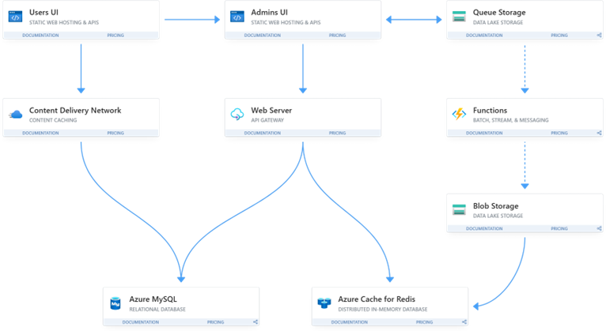
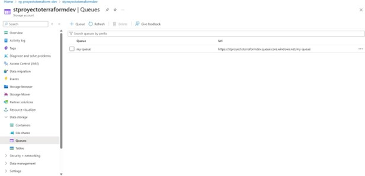

# Repositorio-C

20171001204 Allan Eduardo Estrada Vasquez
20141004605	Sergio Reyniery Garay Godoy
 
Arquitectura

 

1.	Servidor para Back Office (API Gateway / Backend)

Se implementa un servidor central que actúa como punto de conexión entre las diferentes vistas del sistema: la interfaz de usuario y la interfaz de administradores. Este servidor centraliza la lógica de negocio, la autenticación y el control de acceso a los recursos. Además, permite aplicar reglas de seguridad más estrictas y facilita la gestión y mantenimiento del sistema de forma centralizada.

2.	Front-End para vista de usuarios

La interfaz de usuarios se presenta como una aplicación web estática separada, enfocada en ofrecer una experiencia rápida y accesible. Al estar desacoplada del backend, puede servirse de forma independiente a través de un CDN, mejorando la velocidad de carga y reduciendo la carga del servidor.

3.	Front-End para vista de administradores

La vista de administradores también se implementa como una aplicación separada. Esta separación permite reforzar los mecanismos de seguridad y limitar el acceso a funciones sensibles como gestión de datos, usuarios o reportes. Asimismo, permite escalar de forma independiente ambas interfaces según las necesidades específicas de cada grupo de usuarios.

4.	Base de datos relacional

El sistema se apoya en una base de datos relacional para almacenar información estructurada y crítica, como datos de usuarios, productos, operaciones y configuraciones del sistema. Este tipo de base de datos garantiza integridad referencial y permite ejecutar consultas complejas y transacciones de manera eficiente.

5.	Base de datos de caché

Se incorpora una base de datos en memoria que actúa como sistema de caché para mejorar el rendimiento en operaciones repetitivas o consultas muy demandadas. Al reducir la cantidad de accesos directos a la base de datos principal, se disminuye la latencia del sistema y se mejora la experiencia del usuario.

6.	Blob Storage

El Blob Storage se utiliza para almacenar archivos grandes y no estructurados como imágenes, documentos o recursos multimedia. Esto evita sobrecargar la base de datos relacional y reduce los costos de almacenamiento. Además, permite integrar fácilmente estos recursos con otros servicios como el CDN o las funciones serverless.
 
7.	Queue Storage

El Queue Storage permite implementar un mecanismo de comunicación asíncrona entre componentes. Gracias a esto, operaciones que requieren más tiempo de procesamiento (como generación de informes o procesamiento de imágenes) pueden colocarse en cola y ejecutarse sin afectar la experiencia del usuario en tiempo real.

8.	CDN (Content Delivery Network)

El CDN distribuye el contenido estático (como archivos JS, CSS e imágenes) a través de una red de servidores ubicados globalmente. Esto mejora la velocidad de carga de la aplicación, reduce la latencia para usuarios en diferentes ubicaciones y descarga al servidor principal de entregar estos recursos continuamente.

9.	Azure Functions

Las Azure Functions permiten ejecutar tareas específicas bajo demanda, sin necesidad de mantener un servidor encendido constantemente. Se usan para procesar elementos en la cola, transformar archivos, generar reportes o realizar tareas programadas. Esta arquitectura "serverless" mejora la eficiencia de recursos y permite escalar automáticamente según la carga.

Creación de proyecto de terraform
 

Creación de Web Apps
 

Queue

Blob Storage
 

Azure Functions
 

Database

Repositorios
Repositorio A

•	https://github.com/Eduardo-332/Repositorio-A.git

Repositorio B

•	https://github.com/Eduardo-332/Repositorio-B.git

Repositorio C

•	https://github.com/Eduardo-332/Repositorio-C.git
 
Conclusiones

1.	Separar la infraestructura en múltiples repositorios ayudó a organizar mejor los distintos componentes del sistema, permitiendo que cada parte pudiera ser desarrollada de manera independiente. Esta división favorece la colaboración entre equipos y la escalabilidad del proyecto, ya que cada grupo puede trabajar en su área sin generar conflictos con otros. Además, facilita el enfoque en buenas prácticas como el principio de responsabilidad única y la automatización CI/CD por componente.
2.	La decisión de realizar ciertas operaciones de manera asíncrona, como la activación de usuarios, se basó en la necesidad de mantener la experiencia del usuario fluida y evitar cuellos de botella. Al usar colas de mensajes y funciones desacopladas, se logra distribuir la carga de trabajo sin afectar la respuesta inmediata del sistema. Esta arquitectura es especialmente útil en escenarios de alto tráfico, donde es vital responder rápido mientras se procesan tareas pesadas en segundo plano.
3.	La combinación de una base de datos relacional y un sistema de caché en memoria fue clave para balancear consistencia y rendimiento. La base de datos relacional garantiza integridad y relaciones complejas entre datos, lo cual es crucial para una plataforma de comercio electrónico. Por otro lado, la capa de caché (como Redis) acelera el acceso a datos consultados frecuentemente, como productos más vendidos o información de usuario. Esta estrategia híbrida mejora considerablemente los tiempos de respuesta y reduce la carga sobre la base de datos.
